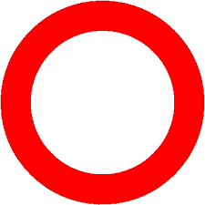

# Python Program to "Mosaify" Images

This is a basic repository for taking images and converting them to simplistic binary files that compress the images to mosaic weaving patterns. This work was inspired by the [Giuditta Brozzetti](https://www.brozzetti.com/en/), most specifically an autonomous loom that was able to create patterns in fabric simply by reading a set of metal punch cards. 

## Getting Started

First, ensure you have a [Python](https://www.python.org/) distribution installed with the [bitstring](https://pypi.org/project/bitstring/), [numpy](https://numpy.org/), [OpenCV](https://pypi.org/project/opencv-python/), and [matplotlib](https://matplotlib.org/) libraries.

### Clone the Repository

```bash
git clone https://github.com/sdc0/mosaify.git
cd mosaify
```

## "Mosaify-ing" Images

Ensure you have an image in the proper format for OpenCV (only .png, .jpeg, and .tiff files have been tested and confirmed as working). Then call the python file mosaify.py with the following arguments:

### Arguments

#### Input (-i, --input)

The full path to the file being used in the operation (image file if mosaify-ing, mosaic file if displaying mosaic). Must have the correct file extension (any accepted OpenCV file extension for images, .mosaic for mosaics).

#### Output (-o, --output)

The path to the directory to store outputs in, will not accept any files, only directories, as the program automatically creates file paths for outputs.
Additionally, this parameter sets the mode of the program, if supplied, the program will be in mosaify-ing mode, thus requiring an image file for the input arg, and if not supplied, going into mosaic display mode, requiring a mosaic file for the input arg.

#### Threads (-t, --threads)

The number of threads horizontally across the outputted mosaic (i.e. the width), only used in mosaify-ing mode and is required in that mode. 

#### Crosses (-c, --crosses)

The number of crosses vertically across the outputted mosaic (i.e. the height), only used in mosaify-ing mode and defaults to the threads argument when not supplied.

#### Threshold (-th, --threshold)

The threshold value for a pixel to be registered as a positive (checked against every channel individually for rgb mode).

#### RGB (-rgb, --rgb)

If passed, sets the program to rgb mode, producing a technically multi-color mosaic (rgb mode is a work in progress, it currently distorts complex images heavily, as is shown in the examples further down). If not passed, the program will run in greyscale mode, producing a black and white mosaic.

#### Display (-d, --display)

If passed, the program will display the mosaic, either the produced mosaic in mosaify-ing mode or the mosaic file in mosaic display mode.

#### Save (-s, --save)

If passed, the program will save the image of the mosaic to png format, mainly used to get the images for examples below.
Additionally, this flag will do nothing if the display flag is not also passed.

### Examples

#### Starting Images

The following are three example images to demonstrate the functionality of the program on and are available in the ```examples``` folder of this repo. From left to right, they are named ```testRed.png```, ```testBlue.png```, and ```furby.png```, and these names will be used for the remaining commands.

<div align="center">
  
  
  
</div>

#### Greyscale Mosaify

Running the following commands will mosaify each image, with 50 threads and crosses for ```testRed.png``` and ```testBlue.png``` and 100 threads and crosses for ```furby.png```, all in greyscale mode.

```bash
python3 mosaify.py -i ./examples/testRed.png -o ./examples -t 50 -d -s
python3 mosaify.py -i ./examples/testBlue.png -o ./examples -t 50 -d -s
python3 mosaify.py -i ./examples/furby.png -o ./examples -t 100 -th 130 -d -s
```

Ths yields the following images in the same order as above.

<div align="center">
  
  
  
</div>

#### RGB Mosaify

Running the following commands will mosaify each image, with 50 threads and crosses for ```testRed.png``` and ```testBlue.png``` and 100 threads and crosses for ```furby.png```, all in rgb mode.

```bash
python3 mosaify.py -i ./examples/testRed.png -o ./examples -t 50 -rgb -d -s
python3 mosaify.py -i ./examples/testBlue.png -o ./examples -t 50 -rgb -d -s
python3 mosaify.py -i ./examples/furby.png -o ./examples -t 100 -th 130 -rgb -d -s
```

Ths yields the following images in the same order as above.

<div align="center">
  
  
  
</div>

#### Different Thread and Cross Counts

Running the following commands will mosaify the ```furby.png``` image with 100 threads and 20 crosses, vertically squashing the image, in both greyscale and rgb mode.

```bash
python3 mosaify.py -i ./examples/furby.png -o ./examples -t 100 -c 20 -th 130 -d -s
python3 mosaify.py -i ./examples/furby.png -o ./examples -t 100 -c 20 -th 130 -rgb -d -s
```

Ths yields the following images.

<div align="center">
  
  
</div>

## Mosaic Files

This program creates a new file with extension ".mosaic" with a unique format specifically for this program's usage. The file is divided into a header and body, as can be read below.

### Header

The header of the file is surrounded by two markers to ensure that the file can be used properly, with both the start and end of the header being the sequence "0xdeadbeef" (I couldn't think of anything better, so here we are).

Inside these markers, the following information is encoded in the following order and bit counts:

<ul>
  <li>Threads: number of threads horizontally across the mosaic, same as the threads argument, represented as a 32-bit integer</li>
  <li>Crosses: number of crosses vertically across the mosaic, same as the crosses argument, represented as a 32-bit integer</li>
  <li>Greyscale: whether or not the image is in greyscale mode or not, 0 -> rgb, 1 -> greyscale, represented as a 1-bit boolean</li>
</ul>

### Body

The body of the file is a continuous bitstream of size ```threads * crosses```, or in the case of rgb ```3 * threads * crosses```. 

Each digit is either a 0 for the vertical thread covering the cross-thread (color hidden) and a 1 for the vertical thread going under the cross-thread (color showing).

The data is stored in rows, so the first line of the body corresponds to the top row of the mosaic. For rgb images, the body can be divided into three contiguous sections: red, green, and blue. This means the red section takes up the first ```threads * crosses``` bits, green the second ```threads * crosses``` bits, and blue the final ```threads * crosses``` bits, yielding the total ```3 * threads * crosses``` bits of the body
